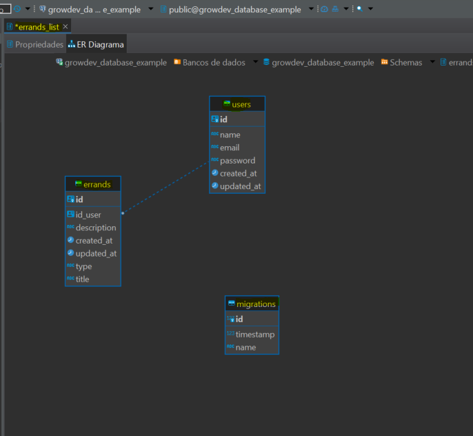
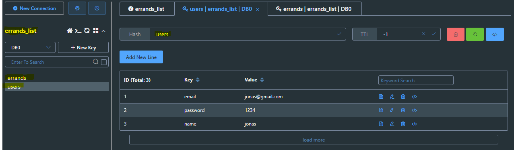

### Avaliação Final do Módulo

# API de Recados

A API de Recados é uma aplicação Node.js que fornece endpoints para gerenciar contas de usuários e tarefas. Ela utiliza o framework Express para lidar com requisições HTTP, o TypeORM para interações com o banco de dados e o Redis para cache. A API permite que os usuários criem, atualizem, excluam e obtenham tarefas, além de gerenciar a autenticação do usuário.

## Modelagem do banco de dados Relacional - PostgreSQL



## Modelagem do banco de dados NoSQL - Redis



## Tabela de Conteúdo

- [Recursos](#recursos)
- [Primeiros Passos](#primeiros-passos)
  - [Pré-requisitos](#pré-requisitos)
  - [Instalação](#instalação)
  - [Configuração](#configuração)
  - [Uso](#uso)
- [Endpoints da API](#endpoints-da-api)

## Recursos

- Registro e login de usuário com autenticação JWT.
- Operações CRUD para tarefas (recados).
- Armazenamento em cache de tarefas usando o Redis.
- Design RESTful da API utilizando o Express.
- Interações com o banco de dados usando o TypeORM.
- Tratamento de erros e formatação de respostas.

## Primeiros Passos

### Pré-requisitos

- Node.js (>= 12.0.0)
- Banco de dados PostgreSQL
- Servidor Redis

### Instalação

1. Clone o repositório:

``````
git clone https://github.com/seudominio/api-recados.git
cd api-recados
``````

2. Instale as dependências:

``````
npm install
``````

### Configuração

1. Crie um arquivo .env na raiz do projeto e configure as seguintes variáveis de ambiente:

``````
PORT=3000
DB_ENV=dev
DB_HOST=localhost
DB_USER=seu_usuario_db
DB_PASS=sua_senha_db
DB_NAME=seu_nome_db
REDIS_HOST=localhost
REDIS_PORT=6379
REDIS_USER=
REDIS_PASS=
JWT_SECRET=seu_segredo_jwt
``````

### Uso

1. Inicie o servidor:

``````
npm run dev
``````

2. Acesse a API em http://localhost:3000.

### Endpoints da API

A documentação da API com informações detalhadas sobre os endpoints, corpos de requisição e respostas pode ser encontrada em API_DOCS.md.


Copyright [Jonas Silva]